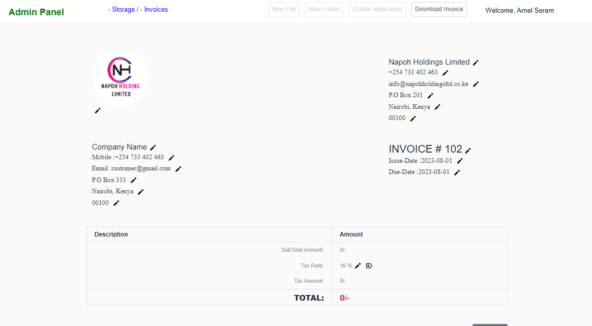

# Invoice Generator
Invoice maker can be customized to the specific client you’re sending it to.
You can choose to add your company or business logo, add sender info (or set default sender in the settings), add client info, 
add as many items as you wish such as products with fixed prices & services with hourly rates, add taxes and to make sure to get paid on
time add invoice payment terms such as banking details or payment link and due date. 
The clean, user-friendly interface of the invoice generator also lets you add new clients and manage them easily. 
Contact, company & payment details and customized invoice templates can be saved for recurring invoices.
Using this online invoice maker, you can generate an unlimited number of invoices and download them as PDF

## Invoice Maker Interface

